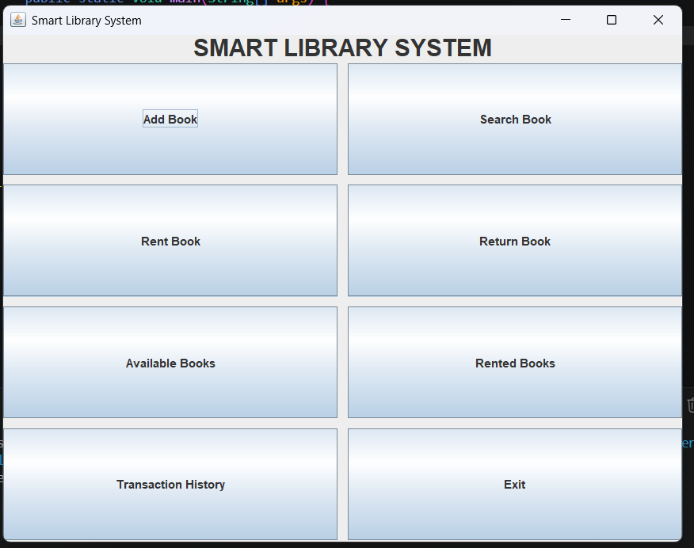
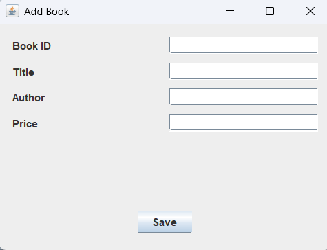
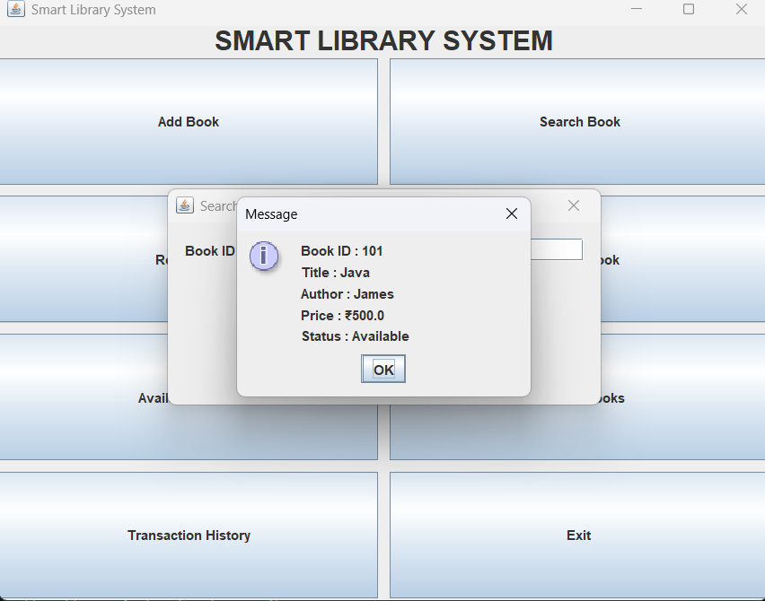
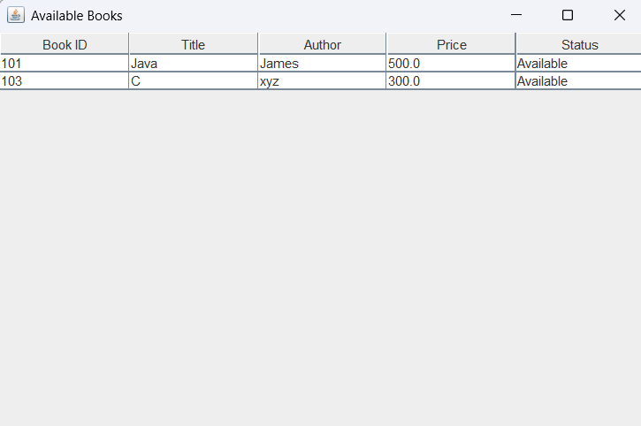
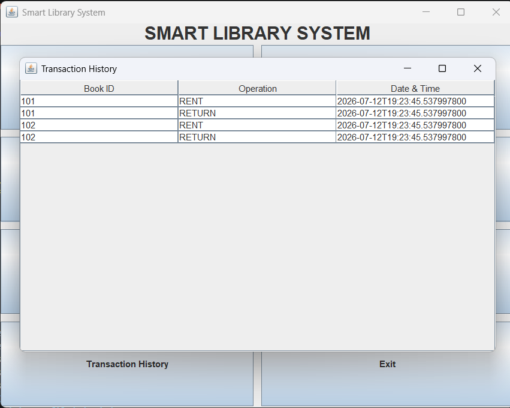

# Library Rental System

A desktop-based Library Management System developed using **Java Swing**, **JDBC**, and **MySQL**. The application provides an intuitive graphical interface to manage books, perform rental and return operations, search books, and maintain transaction records.

---

## Project Overview

Library Rental System is a desktop application developed using Java Swing, JDBC, and MySQL. It enables users to efficiently manage library books by performing operations such as adding books, searching, renting, returning, and viewing transaction history through an intuitive graphical interface.

---

## Features

- Add new books to the library
- Search books by Book ID
- Rent books
- Return books
- View available books
- View rented books
- View transaction history
- Store all data permanently in a MySQL database
- User-friendly Java Swing interface

---

## Technologies Used

| Technology | Purpose |
|------------|---------|
| Java | Programming Language |
| Java Swing | Graphical User Interface |
| JDBC | Database Connectivity |
| MySQL | Database Management |
| MySQL Connector/J | JDBC Driver |
| VS Code | Development Environment |

---

## Project Architecture

```
                User
                  │
                  ▼
          Java Swing GUI
                  │
                  ▼
           Service Layer
                  │
                  ▼
          DAO (BookDAO)
                  │
                  ▼
              JDBC Driver
                  │
                  ▼
            MySQL Database
```

---

## Project Structure

```
Library-Rental-System
│
├── database1/
│   ├── DBConnection.java
│   └── BookDAO.java
│
├── model/
│   ├── Book.java
│   └── Transaction.java
│
├── repository/
│   └── LibraryRepository.java
│
├── service/
│   └── Library.java
│
├── strategy/
│   ├── SearchStrategy.java
│   ├── SearchById.java
│   └── SearchByTitle.java
│
├── ui/
│   ├── MainFrame.java
│   ├── AddBookFrame.java
│   ├── SearchBookFrame.java
│   ├── RentBookFrame.java
│   ├── ReturnBookFrame.java
│   ├── AvailableBooksFrame.java
│   ├── RentedBooksFrame.java
│   └── TransactionHistoryFrame.java
│
├── lib/
│   └── mysql-connector-j-9.7.0.jar
│
├── screenshots/
│   ├── home.png
│   ├── addBook.png
│   ├── searchBook.png
│   ├── availableBooks.png
│   └── transactions.png
│
├── LibraryDB.sql
├── Main.java
├── README.md
└── .gitignore
```

---

## Database

**Database Name**

```
librarydb
```

### Tables

- Books
- Transactions

Import the provided **LibraryDB.sql** file before running the application.

---

## Setup Instructions

### 1. Clone the repository

```bash
git clone https://github.com/YOUR_USERNAME/SmartLibrary.git
```

### 2. Open the project

Open the project using **VS Code** (or any Java IDE).

### 3. Import the database

Open **MySQL Workbench** and import:

```
LibraryDB.sql
```

### 4. Configure database connection

Create a file named:

```
config.properties
```

Add the following:

```properties
db.url=jdbc:mysql://localhost:3306/librarydb
db.user=root
db.password=YOUR_PASSWORD
```

Replace `YOUR_PASSWORD` with your MySQL password.

### 5. Add MySQL Connector/J

Download and add **mysql-connector-j** to your project's libraries.

### 6. Run the application

Run:

```
Main.java
```

---

## Screenshots

### Home Page



---

### Add Book



---

### Search Book



---

### Available Books



---

### Transaction History



---

## Learning Outcomes

This project helped in understanding:

- Object-Oriented Programming (OOP)
- Java Swing GUI Development
- JDBC Connectivity
- CRUD Operations
- MySQL Database Integration
- Layered Software Architecture
- Event-Driven Programming
- Database Design and SQL

---

## Future Enhancements

Possible improvements include:

- User Authentication
- Book Categories
- Due Date Management
- Fine Calculation
- Student Management
- Dashboard with Statistics
- Email Notifications

---

## Author

**Harshitha Minnikanti**

B.Tech – Artificial Intelligence & Data Science

Sri Vishnu Engineering College for Women

GitHub: https://github.com/Harshitha2866

---

## License

This project is developed for educational purposes.